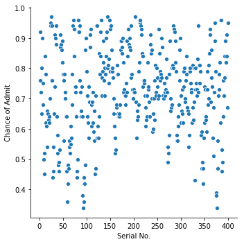
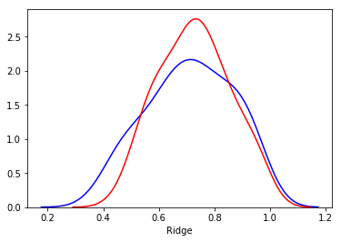
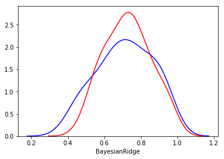
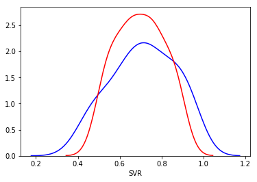

# 1. Importing Libraries


```python
import os
for dirname, _, filenames in os.walk('/kaggle/input'):
    for filename in filenames:
        print(os.path.join(dirname, filename))

```

    /kaggle/input/graduate-admissions/Admission_Predict_Ver1.1.csv
    /kaggle/input/graduate-admissions/Admission_Predict.csv
    


```python
import pandas as pd
import numpy as np
import matplotlib.pyplot as plt
import seaborn as sns
import warnings
warnings.filterwarnings('ignore')
```

# 2. Loading Dataset


```python
df = pd.read_csv('../input/graduate-admissions/Admission_Predict.csv')
```


```python
df.head()
```


<div>
<style scoped>
    .dataframe tbody tr th:only-of-type {
        vertical-align: middle;
    }

    .dataframe tbody tr th {
        vertical-align: top;
    }

    .dataframe thead th {
        text-align: right;
    }
</style>
<table border="1" class="dataframe">
  <thead>
    <tr style="text-align: right;">
      <th></th>
      <th>Serial No.</th>
      <th>GRE Score</th>
      <th>TOEFL Score</th>
      <th>University Rating</th>
      <th>SOP</th>
      <th>LOR</th>
      <th>CGPA</th>
      <th>Research</th>
      <th>Chance of Admit</th>
    </tr>
  </thead>
  <tbody>
    <tr>
      <th>0</th>
      <td>1</td>
      <td>337</td>
      <td>118</td>
      <td>4</td>
      <td>4.5</td>
      <td>4.5</td>
      <td>9.65</td>
      <td>1</td>
      <td>0.92</td>
    </tr>
    <tr>
      <th>1</th>
      <td>2</td>
      <td>324</td>
      <td>107</td>
      <td>4</td>
      <td>4.0</td>
      <td>4.5</td>
      <td>8.87</td>
      <td>1</td>
      <td>0.76</td>
    </tr>
    <tr>
      <th>2</th>
      <td>3</td>
      <td>316</td>
      <td>104</td>
      <td>3</td>
      <td>3.0</td>
      <td>3.5</td>
      <td>8.00</td>
      <td>1</td>
      <td>0.72</td>
    </tr>
    <tr>
      <th>3</th>
      <td>4</td>
      <td>322</td>
      <td>110</td>
      <td>3</td>
      <td>3.5</td>
      <td>2.5</td>
      <td>8.67</td>
      <td>1</td>
      <td>0.80</td>
    </tr>
    <tr>
      <th>4</th>
      <td>5</td>
      <td>314</td>
      <td>103</td>
      <td>2</td>
      <td>2.0</td>
      <td>3.0</td>
      <td>8.21</td>
      <td>0</td>
      <td>0.65</td>
    </tr>
  </tbody>
</table>
</div>


 ### 2.a Checking Columns And Removing Spaces


```python
df.columns
```


    Index(['Serial No.', 'GRE Score', 'TOEFL Score', 'University Rating', 'SOP',
           'LOR ', 'CGPA', 'Research', 'Chance of Admit '],
          dtype='object')


```python
df = df.rename(columns={'LOR ':'LOR','Chance of Admit ':'Chance of Admit'})
```


```python
df.columns
```


    Index(['Serial No.', 'GRE Score', 'TOEFL Score', 'University Rating', 'SOP',
           'LOR', 'CGPA', 'Research', 'Chance of Admit'],
          dtype='object')


### 2.b Checking For Null Values In Columns
* No null values were found in columns


```python
for col in df.columns:
    print(col+' has '+ str(df[col].isnull().sum()) + ' null values')
```

    Serial No. has 0 null values
    GRE Score has 0 null values
    TOEFL Score has 0 null values
    University Rating has 0 null values
    SOP has 0 null values
    LOR has 0 null values
    CGPA has 0 null values
    Research has 0 null values
    Chance of Admit has 0 null values
    

### 2.c understanding datatypes in dataframe


```python
df.info()
```

    <class 'pandas.core.frame.DataFrame'>
    RangeIndex: 400 entries, 0 to 399
    Data columns (total 9 columns):
    Serial No.           400 non-null int64
    GRE Score            400 non-null int64
    TOEFL Score          400 non-null int64
    University Rating    400 non-null int64
    SOP                  400 non-null float64
    LOR                  400 non-null float64
    CGPA                 400 non-null float64
    Research             400 non-null int64
    Chance of Admit      400 non-null float64
    dtypes: float64(4), int64(5)
    memory usage: 28.2 KB
    


```python
df.describe()
```


<div>
<style scoped>
    .dataframe tbody tr th:only-of-type {
        vertical-align: middle;
    }

    .dataframe tbody tr th {
        vertical-align: top;
    }

    .dataframe thead th {
        text-align: right;
    }
</style>
<table border="1" class="dataframe">
  <thead>
    <tr style="text-align: right;">
      <th></th>
      <th>Serial No.</th>
      <th>GRE Score</th>
      <th>TOEFL Score</th>
      <th>University Rating</th>
      <th>SOP</th>
      <th>LOR</th>
      <th>CGPA</th>
      <th>Research</th>
      <th>Chance of Admit</th>
    </tr>
  </thead>
  <tbody>
    <tr>
      <th>count</th>
      <td>400.000000</td>
      <td>400.000000</td>
      <td>400.000000</td>
      <td>400.000000</td>
      <td>400.000000</td>
      <td>400.000000</td>
      <td>400.000000</td>
      <td>400.000000</td>
      <td>400.000000</td>
    </tr>
    <tr>
      <th>mean</th>
      <td>200.500000</td>
      <td>316.807500</td>
      <td>107.410000</td>
      <td>3.087500</td>
      <td>3.400000</td>
      <td>3.452500</td>
      <td>8.598925</td>
      <td>0.547500</td>
      <td>0.724350</td>
    </tr>
    <tr>
      <th>std</th>
      <td>115.614301</td>
      <td>11.473646</td>
      <td>6.069514</td>
      <td>1.143728</td>
      <td>1.006869</td>
      <td>0.898478</td>
      <td>0.596317</td>
      <td>0.498362</td>
      <td>0.142609</td>
    </tr>
    <tr>
      <th>min</th>
      <td>1.000000</td>
      <td>290.000000</td>
      <td>92.000000</td>
      <td>1.000000</td>
      <td>1.000000</td>
      <td>1.000000</td>
      <td>6.800000</td>
      <td>0.000000</td>
      <td>0.340000</td>
    </tr>
    <tr>
      <th>25%</th>
      <td>100.750000</td>
      <td>308.000000</td>
      <td>103.000000</td>
      <td>2.000000</td>
      <td>2.500000</td>
      <td>3.000000</td>
      <td>8.170000</td>
      <td>0.000000</td>
      <td>0.640000</td>
    </tr>
    <tr>
      <th>50%</th>
      <td>200.500000</td>
      <td>317.000000</td>
      <td>107.000000</td>
      <td>3.000000</td>
      <td>3.500000</td>
      <td>3.500000</td>
      <td>8.610000</td>
      <td>1.000000</td>
      <td>0.730000</td>
    </tr>
    <tr>
      <th>75%</th>
      <td>300.250000</td>
      <td>325.000000</td>
      <td>112.000000</td>
      <td>4.000000</td>
      <td>4.000000</td>
      <td>4.000000</td>
      <td>9.062500</td>
      <td>1.000000</td>
      <td>0.830000</td>
    </tr>
    <tr>
      <th>max</th>
      <td>400.000000</td>
      <td>340.000000</td>
      <td>120.000000</td>
      <td>5.000000</td>
      <td>5.000000</td>
      <td>5.000000</td>
      <td>9.920000</td>
      <td>1.000000</td>
      <td>0.970000</td>
    </tr>
  </tbody>
</table>
</div>


## 3. Exploratory Data Analysis

### 3.a Checking for columns with categorical data and contineous data
* Columns SOP,LOR,Research And University Rating have categorical data
* Refrence Links
    https://www.datacamp.com/community/tutorials/categorical-data
    


```python
for col in df.columns:
    print(col + ' ' + str(len(df[col].value_counts())))
```

    Serial No. 400
    GRE Score 49
    TOEFL Score 29
    University Rating 5
    SOP 9
    LOR 9
    CGPA 168
    Research 2
    Chance of Admit 60
    


```python
df.info()
```

    <class 'pandas.core.frame.DataFrame'>
    RangeIndex: 400 entries, 0 to 399
    Data columns (total 9 columns):
    Serial No.           400 non-null int64
    GRE Score            400 non-null int64
    TOEFL Score          400 non-null int64
    University Rating    400 non-null int64
    SOP                  400 non-null float64
    LOR                  400 non-null float64
    CGPA                 400 non-null float64
    Research             400 non-null int64
    Chance of Admit      400 non-null float64
    dtypes: float64(4), int64(5)
    memory usage: 28.2 KB
    

checking distinct values in categorical features


```python
catList = ['Research','SOP','LOR','University Rating']
for col in catList:
    print(df[col].unique())
```

    [1 0]
    [4.5 4.  3.  3.5 2.  5.  1.5 1.  2.5]
    [4.5 3.5 2.5 3.  4.  1.5 2.  5.  1. ]
    [4 3 2 5 1]
    

### 3.b Checking Distribution Of Each Column


```python
for col in df.columns:
    plt.figure()
    sns.distplot(df[col])
```


### 3.c Checking relation between target feature and each feature
> no conclusion can be drawn from serial number <br>
> chance of admit increases with increase in gre score <br>
> chance of admit increases with increase in toefl score <br>
> chance of admit increases with increase in university rating <br>
> chance of admit increases with increase in SOP <br>
> chance of admit increases with increase in LOR <br>
> chance of admit increases with increase in CGPA <br>
> chance of admit increases with increase in Research <br>


```python
for col in df.columns:
    if col != 'Chance of Admit':
        plt.figure()
        sns.relplot(x=col,y='Chance of Admit',data=df)
        plt.ylabel('Chance of Admit')
        plt.xlabel(col)
```


    <Figure size 432x288 with 0 Axes>





    <Figure size 432x288 with 0 Axes>


    <Figure size 432x288 with 0 Axes>


    <Figure size 432x288 with 0 Axes>


    <Figure size 432x288 with 0 Axes>


    <Figure size 432x288 with 0 Axes>


    <Figure size 432x288 with 0 Axes>


    <Figure size 432x288 with 0 Axes>


### 3.d Plotting Categorical Distributions
> Chance Of Admit is more with research <br>
> Chance of Admit increases with SOP <br>
> Chance Of Admit increases with LOR <br>
> CHance of admit increases with University Rating <br>


```python
for col in catList:
    plt.figure()
    sns.catplot(x=col,y='Chance of Admit',kind='bar',data=df)
```


    <Figure size 432x288 with 0 Axes>


    <Figure size 432x288 with 0 Axes>


    <Figure size 432x288 with 0 Axes>


    <Figure size 432x288 with 0 Axes>


### 3.e Checking Correlation Between Features
> Serial No. has no relation to Chance Of Admit <br>
> CGPA, GRE Score, TOEFL Score and University Rating are top 5 parameters <br>
> Serial No. is not showing much correlation with any feature <br>
> GRE Score score has strong coorelation with TOEFL Score and CGPA <br>
> Research correlations are not very strong with any feature <br>


```python
dfCorr = df.corr()
dfCorr['Chance of Admit'].sort_values(ascending=False)
```


    Chance of Admit      1.000000
    CGPA                 0.873289
    GRE Score            0.802610
    TOEFL Score          0.791594
    University Rating    0.711250
    SOP                  0.675732
    LOR                  0.669889
    Research             0.553202
    Serial No.           0.042336
    Name: Chance of Admit, dtype: float64


#### 3.e.1 correlational maps


```python
plt.figure(figsize=(10,10))
sns.heatmap(dfCorr,annot=True,linewidths=.5,cmap="magma",fmt='.2f')
```


    <matplotlib.axes._subplots.AxesSubplot at 0x7f09cc0e2d30>


## 4.Feature Engineering

### 4.a Outlier detection


```python
def detect_outliers(df,features):
    outlier_indices = []
    
    for col in features:
        #1st quartile
        Q1 = np.percentile(df[col],25)
        #3rd quartile
        Q3 = np.percentile(df[col],75)
        #Interquartile range
        IQR = Q3-Q1
        
        # outlier step
        outlier_step = 1.5 * IQR
        
        #list of indices of outliers
        outlier_list_col = df[(df[col] < Q1 - outlier_step) | 
                             (df[col] > Q3 + outlier_step)].index
        
        outlier_indices.extend(outlier_list_col)
        
    return outlier_indices
```


```python
outliers_to_drop = detect_outliers(df,df.columns)
outlierDf = df.loc[outliers_to_drop]
```


```python
df = df.drop(outliers_to_drop,axis=0).reset_index(drop=True)
```


```python
df.head()
```


<div>
<style scoped>
    .dataframe tbody tr th:only-of-type {
        vertical-align: middle;
    }

    .dataframe tbody tr th {
        vertical-align: top;
    }

    .dataframe thead th {
        text-align: right;
    }
</style>
<table border="1" class="dataframe">
  <thead>
    <tr style="text-align: right;">
      <th></th>
      <th>Serial No.</th>
      <th>GRE Score</th>
      <th>TOEFL Score</th>
      <th>University Rating</th>
      <th>SOP</th>
      <th>LOR</th>
      <th>CGPA</th>
      <th>Research</th>
      <th>Chance of Admit</th>
    </tr>
  </thead>
  <tbody>
    <tr>
      <th>0</th>
      <td>1</td>
      <td>337</td>
      <td>118</td>
      <td>4</td>
      <td>4.5</td>
      <td>4.5</td>
      <td>9.65</td>
      <td>1</td>
      <td>0.92</td>
    </tr>
    <tr>
      <th>1</th>
      <td>2</td>
      <td>324</td>
      <td>107</td>
      <td>4</td>
      <td>4.0</td>
      <td>4.5</td>
      <td>8.87</td>
      <td>1</td>
      <td>0.76</td>
    </tr>
    <tr>
      <th>2</th>
      <td>3</td>
      <td>316</td>
      <td>104</td>
      <td>3</td>
      <td>3.0</td>
      <td>3.5</td>
      <td>8.00</td>
      <td>1</td>
      <td>0.72</td>
    </tr>
    <tr>
      <th>3</th>
      <td>4</td>
      <td>322</td>
      <td>110</td>
      <td>3</td>
      <td>3.5</td>
      <td>2.5</td>
      <td>8.67</td>
      <td>1</td>
      <td>0.80</td>
    </tr>
    <tr>
      <th>4</th>
      <td>5</td>
      <td>314</td>
      <td>103</td>
      <td>2</td>
      <td>2.0</td>
      <td>3.0</td>
      <td>8.21</td>
      <td>0</td>
      <td>0.65</td>
    </tr>
  </tbody>
</table>
</div>


### 4.c Feature Selection
> from correlation analysis we can remove serial number column


```python
df = df.drop(['Serial No.'], axis=1)
```


```python
# Feature Importance
X = df.iloc[:,:7]
Y = df.iloc[:,-1]

from sklearn.ensemble import ExtraTreesRegressor
model = ExtraTreesRegressor()
model.fit(X,Y)
print(model.feature_importances_)
feat_importances = pd.Series(model.feature_importances_, index=X.columns)
feat_importances.nlargest(10).plot(kind='barh')
plt.show()
```

    [0.11977561 0.15562412 0.05338862 0.06132903 0.07579122 0.49279996
     0.04129144]
    


### 4.b Encoding
> since for research both 0 and 1 are at same level this needs one hot encoding


```python
from sklearn.preprocessing import OneHotEncoder
# saving a copy
dfEnc = df.copy()
```


```python
enc = OneHotEncoder(categorical_features=[6])
dfEnc = enc.fit_transform(dfEnc).toarray()
```

    /opt/conda/lib/python3.6/site-packages/sklearn/preprocessing/_encoders.py:451: DeprecationWarning: The 'categorical_features' keyword is deprecated in version 0.20 and will be removed in 0.22. You can use the ColumnTransformer instead.
      "use the ColumnTransformer instead.", DeprecationWarning)
    


```python
dfEnc.shape
```


    (396, 9)


```python
dfEnc = pd.DataFrame(dfEnc)
```


```python
dfEnc.head()
```


<div>
<style scoped>
    .dataframe tbody tr th:only-of-type {
        vertical-align: middle;
    }

    .dataframe tbody tr th {
        vertical-align: top;
    }

    .dataframe thead th {
        text-align: right;
    }
</style>
<table border="1" class="dataframe">
  <thead>
    <tr style="text-align: right;">
      <th></th>
      <th>0</th>
      <th>1</th>
      <th>2</th>
      <th>3</th>
      <th>4</th>
      <th>5</th>
      <th>6</th>
      <th>7</th>
      <th>8</th>
    </tr>
  </thead>
  <tbody>
    <tr>
      <th>0</th>
      <td>0.0</td>
      <td>1.0</td>
      <td>337.0</td>
      <td>118.0</td>
      <td>4.0</td>
      <td>4.5</td>
      <td>4.5</td>
      <td>9.65</td>
      <td>0.92</td>
    </tr>
    <tr>
      <th>1</th>
      <td>0.0</td>
      <td>1.0</td>
      <td>324.0</td>
      <td>107.0</td>
      <td>4.0</td>
      <td>4.0</td>
      <td>4.5</td>
      <td>8.87</td>
      <td>0.76</td>
    </tr>
    <tr>
      <th>2</th>
      <td>0.0</td>
      <td>1.0</td>
      <td>316.0</td>
      <td>104.0</td>
      <td>3.0</td>
      <td>3.0</td>
      <td>3.5</td>
      <td>8.00</td>
      <td>0.72</td>
    </tr>
    <tr>
      <th>3</th>
      <td>0.0</td>
      <td>1.0</td>
      <td>322.0</td>
      <td>110.0</td>
      <td>3.0</td>
      <td>3.5</td>
      <td>2.5</td>
      <td>8.67</td>
      <td>0.80</td>
    </tr>
    <tr>
      <th>4</th>
      <td>1.0</td>
      <td>0.0</td>
      <td>314.0</td>
      <td>103.0</td>
      <td>2.0</td>
      <td>2.0</td>
      <td>3.0</td>
      <td>8.21</td>
      <td>0.65</td>
    </tr>
  </tbody>
</table>
</div>


```python
df.head()
df.rename(columns={})
```


<div>
<style scoped>
    .dataframe tbody tr th:only-of-type {
        vertical-align: middle;
    }

    .dataframe tbody tr th {
        vertical-align: top;
    }

    .dataframe thead th {
        text-align: right;
    }
</style>
<table border="1" class="dataframe">
  <thead>
    <tr style="text-align: right;">
      <th></th>
      <th>GRE Score</th>
      <th>TOEFL Score</th>
      <th>University Rating</th>
      <th>SOP</th>
      <th>LOR</th>
      <th>CGPA</th>
      <th>Research</th>
      <th>Chance of Admit</th>
    </tr>
  </thead>
  <tbody>
    <tr>
      <th>0</th>
      <td>337</td>
      <td>118</td>
      <td>4</td>
      <td>4.5</td>
      <td>4.5</td>
      <td>9.65</td>
      <td>1</td>
      <td>0.92</td>
    </tr>
    <tr>
      <th>1</th>
      <td>324</td>
      <td>107</td>
      <td>4</td>
      <td>4.0</td>
      <td>4.5</td>
      <td>8.87</td>
      <td>1</td>
      <td>0.76</td>
    </tr>
    <tr>
      <th>2</th>
      <td>316</td>
      <td>104</td>
      <td>3</td>
      <td>3.0</td>
      <td>3.5</td>
      <td>8.00</td>
      <td>1</td>
      <td>0.72</td>
    </tr>
    <tr>
      <th>3</th>
      <td>322</td>
      <td>110</td>
      <td>3</td>
      <td>3.5</td>
      <td>2.5</td>
      <td>8.67</td>
      <td>1</td>
      <td>0.80</td>
    </tr>
    <tr>
      <th>4</th>
      <td>314</td>
      <td>103</td>
      <td>2</td>
      <td>2.0</td>
      <td>3.0</td>
      <td>8.21</td>
      <td>0</td>
      <td>0.65</td>
    </tr>
    <tr>
      <th>...</th>
      <td>...</td>
      <td>...</td>
      <td>...</td>
      <td>...</td>
      <td>...</td>
      <td>...</td>
      <td>...</td>
      <td>...</td>
    </tr>
    <tr>
      <th>391</th>
      <td>324</td>
      <td>110</td>
      <td>3</td>
      <td>3.5</td>
      <td>3.5</td>
      <td>9.04</td>
      <td>1</td>
      <td>0.82</td>
    </tr>
    <tr>
      <th>392</th>
      <td>325</td>
      <td>107</td>
      <td>3</td>
      <td>3.0</td>
      <td>3.5</td>
      <td>9.11</td>
      <td>1</td>
      <td>0.84</td>
    </tr>
    <tr>
      <th>393</th>
      <td>330</td>
      <td>116</td>
      <td>4</td>
      <td>5.0</td>
      <td>4.5</td>
      <td>9.45</td>
      <td>1</td>
      <td>0.91</td>
    </tr>
    <tr>
      <th>394</th>
      <td>312</td>
      <td>103</td>
      <td>3</td>
      <td>3.5</td>
      <td>4.0</td>
      <td>8.78</td>
      <td>0</td>
      <td>0.67</td>
    </tr>
    <tr>
      <th>395</th>
      <td>333</td>
      <td>117</td>
      <td>4</td>
      <td>5.0</td>
      <td>4.0</td>
      <td>9.66</td>
      <td>1</td>
      <td>0.95</td>
    </tr>
  </tbody>
</table>
<p>396 rows × 8 columns</p>
</div>


## 5. Feature Scaling and Data Split


```python
y = pd.DataFrame(dfEnc.iloc[:,-1])
x = dfEnc.iloc[:,0:8]
```

### 5.a) Splitting data


```python
from sklearn.model_selection import train_test_split
x_train,x_test,y_train,y_test = train_test_split(x,y,test_size=0.2,random_state=42)
```

### 5.b) Scaling Data


```python
from sklearn.preprocessing import StandardScaler
scaler = StandardScaler()
x_train = scaler.fit_transform(x_train)
x_test = scaler.transform(x_test)
```

## 6 Regression Algorithms


```python
from sklearn.linear_model import LinearRegression, Ridge,Lasso, ElasticNet 
from sklearn.linear_model import BayesianRidge
from sklearn.svm import SVR
from sklearn.linear_model import SGDRegressor
from sklearn.neighbors import KNeighborsRegressor
from sklearn.gaussian_process import GaussianProcessRegressor
from sklearn.ensemble import RandomForestRegressor
from sklearn.tree import DecisionTreeRegressor
modelList = [LinearRegression, Ridge,Lasso, ElasticNet,BayesianRidge,
SVR,SGDRegressor,KNeighborsRegressor,GaussianProcessRegressor,RandomForestRegressor,
DecisionTreeRegressor]
```


```python
RegModelScores = []
def predictFunc(model):
    model=model()
    model_name = model.__class__.__name__
    model.fit(x_train,y_train)
    model_score_test = model.score(x_test,y_test)
    model_score_train = model.score(x_train,y_train)
    model_pred = model.predict(x_test)
    
    plt.figure()
    sns.distplot(y_test,hist=False,color='blue')
    sns.distplot(model_pred,hist=False,color='red')
    plt.xlabel(model_name)
    RegModelScores.append([model_name,model_score_test,model_score_train])
```


```python
for model in modelList:
    predictFunc(model)
```











### 6.a) Regression Algorithms Chart Representation
> Linear Regression has highest Score


```python
dfReg = pd.DataFrame(RegModelScores,columns=['model','train_score','test_score'])
```


```python
dfReg
```


<div>
<style scoped>
    .dataframe tbody tr th:only-of-type {
        vertical-align: middle;
    }

    .dataframe tbody tr th {
        vertical-align: top;
    }

    .dataframe thead th {
        text-align: right;
    }
</style>
<table border="1" class="dataframe">
  <thead>
    <tr style="text-align: right;">
      <th></th>
      <th>model</th>
      <th>train_score</th>
      <th>test_score</th>
    </tr>
  </thead>
  <tbody>
    <tr>
      <th>0</th>
      <td>LinearRegression</td>
      <td>0.798053</td>
      <td>0.795787</td>
    </tr>
    <tr>
      <th>1</th>
      <td>Ridge</td>
      <td>0.800208</td>
      <td>0.795880</td>
    </tr>
    <tr>
      <th>2</th>
      <td>Lasso</td>
      <td>-0.017781</td>
      <td>0.000000</td>
    </tr>
    <tr>
      <th>3</th>
      <td>ElasticNet</td>
      <td>-0.017781</td>
      <td>0.000000</td>
    </tr>
    <tr>
      <th>4</th>
      <td>BayesianRidge</td>
      <td>0.800054</td>
      <td>0.795697</td>
    </tr>
    <tr>
      <th>5</th>
      <td>SVR</td>
      <td>0.740245</td>
      <td>0.745588</td>
    </tr>
    <tr>
      <th>6</th>
      <td>SGDRegressor</td>
      <td>0.802861</td>
      <td>0.790507</td>
    </tr>
    <tr>
      <th>7</th>
      <td>KNeighborsRegressor</td>
      <td>0.761683</td>
      <td>0.824710</td>
    </tr>
    <tr>
      <th>8</th>
      <td>GaussianProcessRegressor</td>
      <td>-0.306290</td>
      <td>1.000000</td>
    </tr>
    <tr>
      <th>9</th>
      <td>RandomForestRegressor</td>
      <td>0.780038</td>
      <td>0.949869</td>
    </tr>
    <tr>
      <th>10</th>
      <td>DecisionTreeRegressor</td>
      <td>0.609812</td>
      <td>1.000000</td>
    </tr>
  </tbody>
</table>
</div>


### 6.b) Regression Algorithms Visual Representation


```python
fig,ax = plt.subplots(figsize=(20,20))
p2 = sns.catplot(ax=ax,y='model',x='train_score',data=dfReg,kind='bar')
#p2.set_xticklabels(p2.get_xticklabels(),rotation=45)
plt.setp(ax.get_yticklabels(),fontsize=24)
plt.close(p2.fig)
```


## 7. Classification Algorithms
> Random Forest CLassifier is the most suitable model to use

### 7.a) preparing target value (making it discrete from contineous)
> We are assuming that if chance of admit is more that 0.8 student will get selected


```python
y_train[8] = y_train[8].apply(lambda x:1 if x>0.8 else 0)
y_test[8] = y_test[8].apply(lambda x:1 if x>0.8 else 0)
```


```python
from sklearn.linear_model import LogisticRegression
from sklearn.metrics import confusion_matrix
from sklearn.metrics import precision_recall_curve
from sklearn.metrics import classification_report
from sklearn.metrics import roc_curve
from sklearn.metrics import r2_score
from sklearn.metrics import precision_score,recall_score
from sklearn.metrics import f1_score
from sklearn.svm import SVC
from sklearn.naive_bayes import GaussianNB
from sklearn.tree import DecisionTreeClassifier
from sklearn.ensemble import RandomForestClassifier
from sklearn.neighbors import KNeighborsClassifier
from sklearn.model_selection import GridSearchCV, cross_val_score,StratifiedKFold, learning_curve
```


```python
conMatList = []
prcList = []
clRep= []
rocDet = []
preScore = []
recScore = []
f1Score = []
yPred = []

def getClassModel(model):
    model = model()
    model_name = model.__class__.__name__
    model.fit(x_train,y_train)
    
    #getting prediction
    y_pred = model.predict(x_test)
    yPred.append([model_name,y_pred])
    
    # getting scores
    
    pre_score = precision_score(y_test,y_pred)
    rec_score= recall_score(y_test,y_pred)
    f1score = f1_score(y_test,y_pred)
    
    preScore.append([model_name,pre_score])
    recScore.append([model_name,rec_score])
    f1Score.append([model_name,f1score])
    
    ## getting confusion matrix
    cm = confusion_matrix(y_test,y_pred)
    matrix = pd.DataFrame(cm,columns=['predicted 0','predicted 1'],
                         index=['Actual 0','Actual 1'])
    conMatList.append([model_name,matrix])
    
     ## getting precision recall curve values
    
    precision, recall, thresholds = precision_recall_curve(y_test,y_pred)
    prcList.append([model_name,precision,recall,thresholds])
    
    ## roc details
    
    fpr,tpr,thresholds = roc_curve(y_test,y_pred)
    rocDet.append([model_name,fpr,tpr,thresholds])
    
    ## classification report
    
    classRep = classification_report(y_test,y_pred)
    clRep.append([model_name,classRep])
```


```python
kfold = StratifiedKFold(n_splits=10)
classModelList = [LogisticRegression,SVC,GaussianNB,DecisionTreeClassifier
                 ,RandomForestClassifier,KNeighborsClassifier]

for model in classModelList:
    getClassModel(model)
    

```

## 7.b) Generating cross validation chart


```python
#getting cross validation scores for each model
cv_results = []
for model in classModelList:
    cv_results.append(cross_val_score(model(),x_train,y_train,scoring='accuracy',
                                     cv=kfold,n_jobs=4))
cv_means = []
cv_std = []

for cv_result in cv_results:
    cv_means.append(cv_result.mean())
    cv_std.append(cv_result.std())
    
model_name = []
for model in classModelList:
    modelIns = model()
    model_name.append(modelIns.__class__.__name__)
    
cv_res = pd.DataFrame({
    "CrossValMeans":cv_means,
    "CrossValErrors":cv_std,
    "Model":model_name
})
  
cv_res
```


<div>
<style scoped>
    .dataframe tbody tr th:only-of-type {
        vertical-align: middle;
    }

    .dataframe tbody tr th {
        vertical-align: top;
    }

    .dataframe thead th {
        text-align: right;
    }
</style>
<table border="1" class="dataframe">
  <thead>
    <tr style="text-align: right;">
      <th></th>
      <th>CrossValMeans</th>
      <th>CrossValErrors</th>
      <th>Model</th>
    </tr>
  </thead>
  <tbody>
    <tr>
      <th>0</th>
      <td>0.930520</td>
      <td>0.036630</td>
      <td>LogisticRegression</td>
    </tr>
    <tr>
      <th>1</th>
      <td>0.931000</td>
      <td>0.047582</td>
      <td>SVC</td>
    </tr>
    <tr>
      <th>2</th>
      <td>0.879695</td>
      <td>0.070086</td>
      <td>GaussianNB</td>
    </tr>
    <tr>
      <th>3</th>
      <td>0.879998</td>
      <td>0.056529</td>
      <td>DecisionTreeClassifier</td>
    </tr>
    <tr>
      <th>4</th>
      <td>0.921133</td>
      <td>0.042849</td>
      <td>RandomForestClassifier</td>
    </tr>
    <tr>
      <th>5</th>
      <td>0.911550</td>
      <td>0.050604</td>
      <td>KNeighborsClassifier</td>
    </tr>
  </tbody>
</table>
</div>


## 7.c) Generating prediction distribution chart


```python
fig,ax = plt.subplots(figsize=(20,10))
p2 = sns.distplot(y_test,hist=False,label='test_set',ax=ax)
for pred in yPred:
    sns.distplot(pred[1],hist=False,label=pred[0],ax=ax)
plt.setp(ax.get_legend().get_texts(), fontsize='22') 
1==1
#plt.close()
```


    True


## 7.d) Generating Confusion Matrix Chart


```python
#conMatList,prcList ,clRep ,rocDet ,preScore ,recScore 
for mat in conMatList:
    print(mat[0])
    print(' ')
    print(mat[1])
    print('-----------------------------------------------')
```

    LogisticRegression
     
              predicted 0  predicted 1
    Actual 0           54            3
    Actual 1            4           19
    -----------------------------------------------
    SVC
     
              predicted 0  predicted 1
    Actual 0           55            2
    Actual 1            5           18
    -----------------------------------------------
    GaussianNB
     
              predicted 0  predicted 1
    Actual 0           53            4
    Actual 1            0           23
    -----------------------------------------------
    DecisionTreeClassifier
     
              predicted 0  predicted 1
    Actual 0           53            4
    Actual 1            5           18
    -----------------------------------------------
    RandomForestClassifier
     
              predicted 0  predicted 1
    Actual 0           55            2
    Actual 1            4           19
    -----------------------------------------------
    KNeighborsClassifier
     
              predicted 0  predicted 1
    Actual 0           55            2
    Actual 1            5           18
    -----------------------------------------------
    

## 7.e) Generating precision,f1 and recall score Chart


```python
precisionDf = pd.DataFrame(preScore,columns=['model','precisionScore'])
recallDf = pd.DataFrame(recScore,columns=['model','recallScore'])
f1Df = pd.DataFrame(f1Score,columns=['model','f1Score'])
precisionDf['f1Score'] = f1Df['f1Score']
precisionDf['recallScore'] = recallDf['recallScore']
precisionDf
```


<div>
<style scoped>
    .dataframe tbody tr th:only-of-type {
        vertical-align: middle;
    }

    .dataframe tbody tr th {
        vertical-align: top;
    }

    .dataframe thead th {
        text-align: right;
    }
</style>
<table border="1" class="dataframe">
  <thead>
    <tr style="text-align: right;">
      <th></th>
      <th>model</th>
      <th>precisionScore</th>
      <th>f1Score</th>
      <th>recallScore</th>
    </tr>
  </thead>
  <tbody>
    <tr>
      <th>0</th>
      <td>LogisticRegression</td>
      <td>0.863636</td>
      <td>0.844444</td>
      <td>0.826087</td>
    </tr>
    <tr>
      <th>1</th>
      <td>SVC</td>
      <td>0.900000</td>
      <td>0.837209</td>
      <td>0.782609</td>
    </tr>
    <tr>
      <th>2</th>
      <td>GaussianNB</td>
      <td>0.851852</td>
      <td>0.920000</td>
      <td>1.000000</td>
    </tr>
    <tr>
      <th>3</th>
      <td>DecisionTreeClassifier</td>
      <td>0.818182</td>
      <td>0.800000</td>
      <td>0.782609</td>
    </tr>
    <tr>
      <th>4</th>
      <td>RandomForestClassifier</td>
      <td>0.904762</td>
      <td>0.863636</td>
      <td>0.826087</td>
    </tr>
    <tr>
      <th>5</th>
      <td>KNeighborsClassifier</td>
      <td>0.900000</td>
      <td>0.837209</td>
      <td>0.782609</td>
    </tr>
  </tbody>
</table>
</div>


## 7.f) Generating ROC Curve


```python
for roc in rocDet:
    print(roc[0])
    fpr = roc[1]
    tpr = roc[2]
    plt.plot(fpr,tpr,label=roc[0])
    plt.legend()

```

    LogisticRegression
    SVC
    GaussianNB
    DecisionTreeClassifier
    RandomForestClassifier
    KNeighborsClassifier
    


```python
for prc in prcList:
    precision = prc[1]
    recall = prc[2]
    plt.plot(precision,recall,label=prc[0])
    plt.legend()
```


## 8 Finalising algorithms and saving models


### 8.a) Regression Althorithm
> Linear Regression is selected as final prediction algorithm


```python
lreg = LinearRegression()
lreg.fit(x_train,y_train)
```


    LinearRegression(copy_X=True, fit_intercept=True, n_jobs=None, normalize=False)


```python
#saving model
import pickle
pkl_Filename = "regModel"

with open(pkl_Filename, 'wb') as file:
    pickle.dump(lreg,file)
```


```python
#cheking if model saved works
with open(pkl_Filename, 'rb') as file: 
    print(file)
    Pickled_LR_Model = pickle.load(file)

y_pred = Pickled_LR_Model.predict(x_test[0].reshape(1,-1))
```

    <_io.BufferedReader name='regModel'>
    


```python
# creating link to download the model
from IPython.display import FileLink
FileLink(pkl_Filename)
```


<a href='regModel' target='_blank'>regModel</a><br>


### 8.b) Saving Classification Model
> Random Forest Classifier was selected


```python
#preparing data for classification
y_train[8] = y_train[8].apply(lambda x:1 if x>0.8 else 0)
y_test[8] = y_test[8].apply(lambda x:1 if x>0.8 else 0)
```


```python
rfc = RandomForestClassifier()
rfc.fit(x_train,y_train)
```


    RandomForestClassifier(bootstrap=True, class_weight=None, criterion='gini',
                           max_depth=None, max_features='auto', max_leaf_nodes=None,
                           min_impurity_decrease=0.0, min_impurity_split=None,
                           min_samples_leaf=1, min_samples_split=2,
                           min_weight_fraction_leaf=0.0, n_estimators=10,
                           n_jobs=None, oob_score=False, random_state=None,
                           verbose=0, warm_start=False)


```python
#saving model
import pickle
pkl_Filename = "classModel"

with open(pkl_Filename, 'wb') as file:
    pickle.dump(rfc,file)
```


```python
#cheking if model saved works
with open(pkl_Filename, 'rb') as file: 
    print(file)
    Pickled_LR_Model = pickle.load(file)

y_pred = Pickled_LR_Model.predict(x_test)
```

    <_io.BufferedReader name='classModel'>
    


```python
# creating link to download the model
from IPython.display import FileLink
FileLink(pkl_Filename)
```


    array([0, 0, 0, 0, 1, 1, 0, 0, 0, 0, 0, 1, 0, 0, 0, 0, 1, 0, 0, 1, 0, 1,
           0, 1, 1, 0, 0, 1, 0, 0, 0, 1, 0, 0, 0, 1, 0, 0, 0, 1, 0, 0, 0, 0,
           0, 0, 1, 0, 0, 0, 0, 0, 0, 0, 0, 1, 0, 0, 1, 0, 0, 0, 0, 1, 0, 0,
           1, 0, 1, 1, 1, 0, 0, 0, 0, 1, 0, 0, 0, 0])


```python

```
